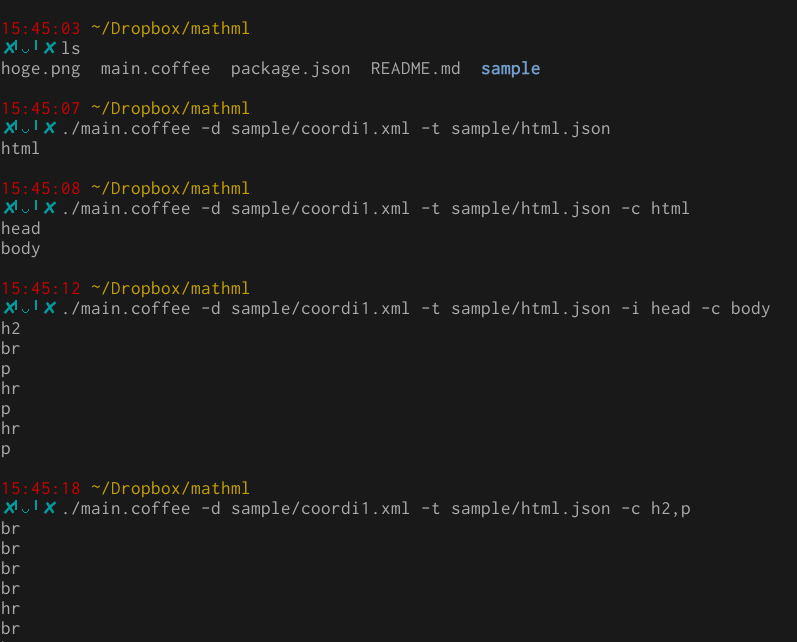
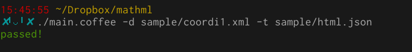

正しい文法で書かれたXML文書からテキストだけを抜き出す。
ただし、中身を見る必要があるタグ (content tags) と、
そのタグより下は見ないタグ (ignore tags) との分類をする。

例えば html 文書の head タグは見ないだろう。

## 利用の例




```sh
cat sample/html.json
{"content":["html","body","h2","p","div","b","font","a"],"ignore":["head","br","math","hr","img"]}
```

## usage 

### 分類

基本のコマンドは次のようになるだろう。

```
./main.coffee -d [document XML file] -t [タグ分類を保存するファイル.json]
```

このタグ (e.g. "head") は content に (ignore に) 分類する、とするときは、
上のコマンドに

```
-c head (-i head)
```

を後ろに付け足す。

未分類なタグを見つけたら、コマンドは必ずそれらを出力する。
分類がすべて終わったら、
緑色の文字で "passed!" を出力する。

### 出力

タグの分類が終わった document XML file と json ファイルが用意できたら

```
./main.coffee -d [document XML file] -t [タグ分類を保存するファイル.json] -o [アウトプットファイル.txt]
```

とする。
未分類なタグがまだあったら、単に標準エラー出力するが、エラーにはしてない。
